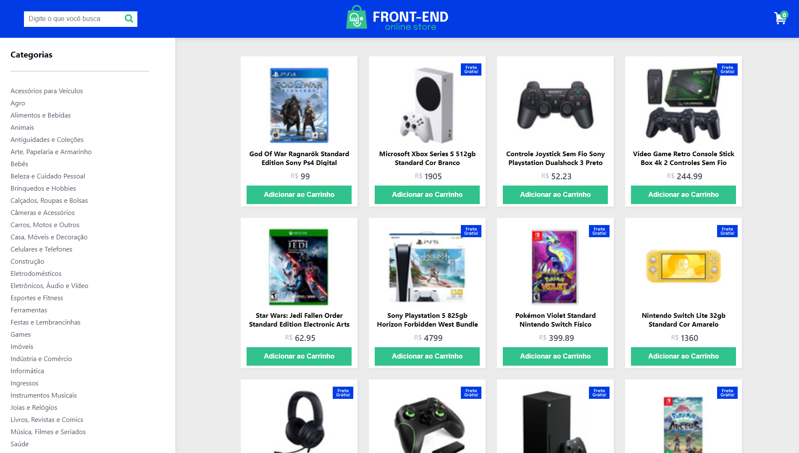

<h1 align="center">Projeto - Front-End Online Store</h1>

  
<strong>👨‍💻 O que foi desenvolvido</strong>
 

Neste projeto criei uma versão simplificada, sem persistência no banco de dados, de uma **loja online**, desenvolvendo em grupo suas funcionalidades de acordo com demandas definidas em um quadro _Kanban_, em um cenário próximo ao do mercado de trabalho.

A partir dessas demandas, teremos uma aplicação em que pessoas usuárias podem:

- Buscar produtos por termos e categorias a partir da _API do Mercado Livre_;
- Interagir com os produtos buscados de modo a adicioná-los e removê-los de um carrinho de compras em diferentes quantidades;
- Visualizar detalhes e avaliações prévias de um produto, bem como criar novas avaliações e;
- Simular a finalização da compra dos itens selecionados.

